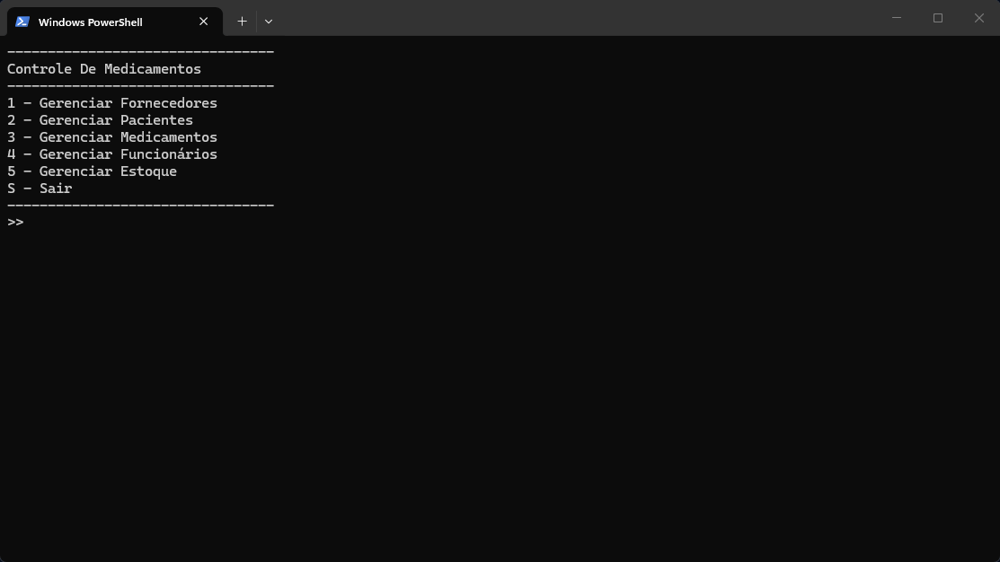

# Sistema de Controle de Medicamentos

Projeto desenvolvido em C# na Academia Do Programador Full-Stack, com foco no gerenciamento de medicamentos, controle de estoque, fornecedores, pacientes e funcionários.

# Funcionalidades

O sistema possui os seguintes módulos:

- Cadastro de fornecedores
- Cadastro de pacientes
- Cadastro de medicamentos
- Cadastro de funcionários
- Controle de estoque
  - Requisições de entrada
  - Requisições de saída

# Módulo de Fornecedores

## Funcionalidades

- Registrar fornecedores
- Visualizar fornecedores cadastrados
- Editar fornecedores
- Excluir fornecedores

# Módulo de Pacientes

## Funcionalidades

- Registrar pacientes
- Visualizar pacientes cadastrados
- Editar pacientes
- Excluir pacientes

# Módulo de Medicamentos

## Funcionalidades

- Registrar medicamentos
- Visualizar medicamentos cadastrados
- Editar medicamentos
- Excluir medicamentos

# Módulo de Funcionários

## Funcionalidades

- Registrar funcionários
- Visualizar funcionários cadastrados
- Editar funcionários
- Excluir funcionários

# Módulo de Estoque

## Requisições de Entrada

### Funcionalidades

- Registrar entradas de medicamentos
- Visualizar entradas registradas

## Requisições de Saída

### Funcionalidades

- Registrar saídas de medicamentos
- Visualizar saídas registradas

# Tecnologias Utilizadas

- C#
- .NET
- Programação Orientada a Objetos (POO)
- Console Application

# Objetivo do Projeto

O objetivo do projeto é aplicar conceitos de:

- Orientação a Objetos
- CRUD
- Validações de negócio
- Controle de estoque
- Estruturação em módulos
- Manipulação de listas e entidades
- Boas práticas em C#

## Como Usar?

1. Clone o repositório ou baixe o código comprimido em .zip.
2. Abra o emulador de terminal e navegue até a pasta raiz.
3. Utilize o comando abaixo para restaurar as dependências do projeto.

   ```
   dotnet restore
   ```

4. Em seguida compile e execute o projeto com o comando:

   ```
   dotnet run --project Controle_De_Medicamentos.ConsoleApp
   ```

## Requisitos

- .NET SDK 10.0+

# Exemplo do Sistema



# Autores

Desenvolvido por Kauan Galvani e Kauan Silva

- https://github.com/KauanGalvani
- https://github.com/k-silvax19
